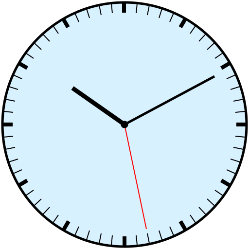

# Clock SVG Generator

This project generates an SVG representation of an analog clock based on the time provided by the user. It draws a clock face with hour, minute, and second hands, as well as the minute divisions.

## Example Output

Here’s an example of what the generated SVG will look like  (with the values 10 10 28):

## Features

- Accepts user input for time in the format `hour minute second` (between `0:00:00` and `23:59:59`).
- Generates an SVG file (`clock.svg`) showing the corresponding clock face with:
  - Hour hand
  - Minute hand
  - Second hand (in red)
  - Minute ticks with special emphasis on hour marks
- The generated clock SVG is compatible with any browser that supports SVG rendering.

## Requirements

- C compiler (I used gcc)
- Math library (for trigonometric functions)

