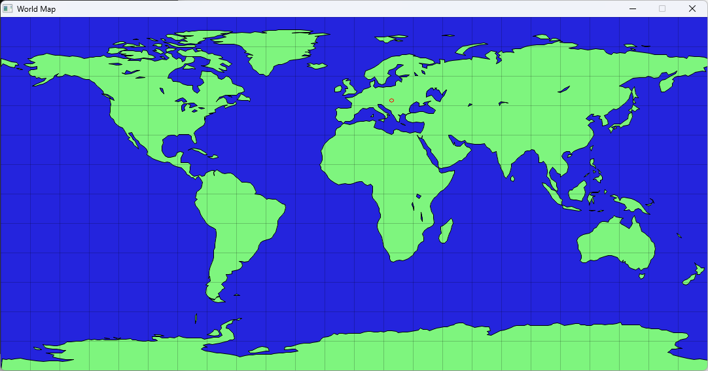

# World Map with Coordinates

This project is a graphical representation of geographical coordinates using the SDL2 library. It aims to visualize oceans, landmasses, lakes, and a specific location (Budapest University of Technology and Economics - BME) on a map. The map is rendered based on latitude and longitude coordinates, and the program provides a grid overlay to represent the global coordinate system.

The application draws geographical features like land and lakes using predefined sets of coordinates. It uses a combination of polygons, lines, and circles to represent these features on the map. 

## Features

- **Ocean Background**: The map is colored in blue to represent the oceans.
- **Land and Lakes**: The landmasses and lakes are rendered using polygons formed from coordinate pairs.
- **BME Location**: The position of Budapest University of Technology and Economics (BME) is marked on the map in red.
- **Grid Overlay**: Longitude and latitude grid lines are drawn faintly to represent global coordinate divisions.
- **Interactive Window**: The program waits for user interaction, where the user can close the window by clicking on it.

## Screenshot

Here is a screenshot of the output from the application:

## Requirements

To compile and run this project, the following dependencies are required:

- **SDL2**
- **SDL2_gfx**

